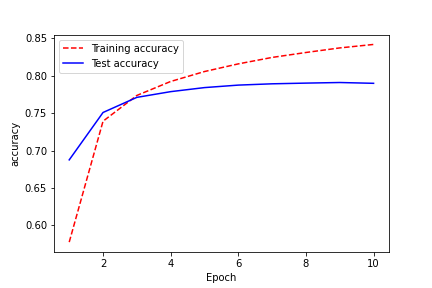
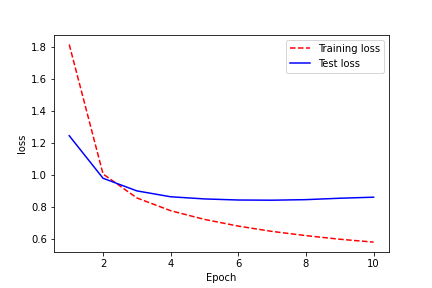
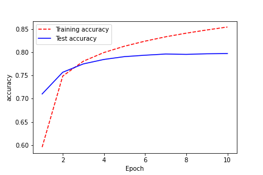
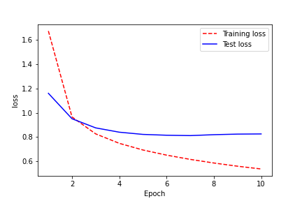
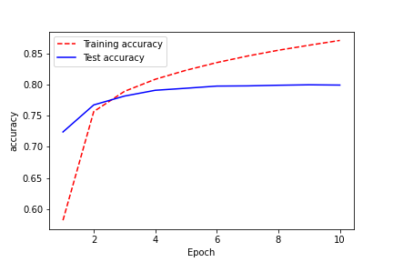
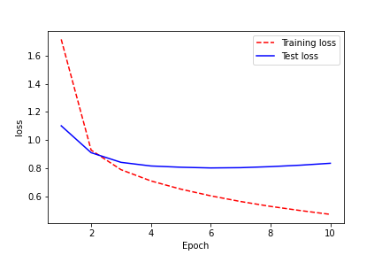
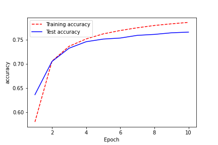
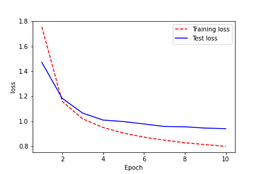

# Отчет по лабораторной работе "Генерация последовательностей"

### Дубинин Артем Олегович, Группа М8О-306Б-17
Номер в группе: 5, Вариант: 5

### Цель работы

Нужно сгенерировать последовательность программы на языке программирования c++ c помощью 
рекурентных сетей. За основу взять несколько различных нейросетевых архитектур:
   - Обычная полносвязная RNN
   - Однослойная LSTM
   - Двухслойная LSTM
   - Однослойный GRU


### Используемые входные данные

Использовались данные взятые с github.com.
А конкретно я решил брать программы узко направленные, в частности я взял гитхабы с направленностью competitive programming.    
(https://github.com/marioyc/Online-Judge-Solutions)    
(https://github.com/bqi343/USACO)  
(https://github.com/dragonslayerx/Competitive-Programming-Repository)  
(https://github.com/SuprDewd/CompetitiveProgramming)  
(https://github.com/likecs/Competitive-Coding)  

Склеим все файлы с расширением cpp, h, и c в один файл.
Удалим все комментарии.  
Размер полученных данных:
```bash
art@mars:~/study/AI/lab_3$ du -sh merged_files.cpp 
4,7M	merged_files.cpp
```

### Предварительная обработка входных данных

Для начала преобразуем все символы текста в численный вид.
```
{
  '\n':   0,
  ' ' :   1,
  '!' :   2,
  '"' :   3,
  '#' :   4,
  '$' :   5,
  '%' :   6,
  '&' :   7,
  "'" :   8,
  '(' :   9,
  ')' :  10,
  '*' :  11,
  '+' :  12,
  ',' :  13,
  '-' :  14,
  '.' :  15,
  '/' :  16,
  '0' :  17,
  '1' :  18,
  '2' :  19,
  ...
}
```  
Возьмем разобьем наш текст на последовательности длины 100.  
```'\nint main() {\n    srand(time(NULL));\n    test();\n    assert(!ANY_FAILED);\n    return 0;\n}\nbool ANY_FA'
'ILED = false;\n\ntemplate <class T>\nvoid assert_equal(T expected, T actual, bool kill = false) {\n    if'
' (!(expected == actual)) {\n        ANY_FAILED = true;\n        cout << "Assertion failed:" << endl;\n  '
'      cout << "Expected: " << expected << endl;\n        cout << "  Actual: " << actual << endl;\n     '
'   if (kill) assert(false);\n    }\n}\n\ntemplate <class T>\nvoid assert_not_equal(T not_expected, T actua'
```
Для каждой последовательности найдем target последовательность, которая является той же последовательностью, только со смещением на единицу.
```
Input data:  '\nint main() {\n    srand(time(NULL));\n    test();\n    assert(!ANY_FAILED);\n    return 0;\n}\nbool ANY_F'
Target data: 'int main() {\n    srand(time(NULL));\n    test();\n    assert(!ANY_FAILED);\n    return 0;\n}\nbool ANY_FA'
``` 
Разобьем наши пары последовательностей <example, target> на пачки.
Это и будем мы подавать на вход.

### Эксперимент 1: One layer GRU  

#### Архитектура сети

```
Model: "sequential"
_________________________________________________________________
Layer (type)                 Output Shape              Param #   
=================================================================
embedding (Embedding)        (64, None, 256)           24576     
_________________________________________________________________
gru (GRU)                    (64, None, 1024)          3938304   
_________________________________________________________________
dense (Dense)                (64, None, 96)            98400     
=================================================================
Total params: 4,061,280
Trainable params: 4,061,280
Non-trainable params: 0
_________________________________________________________________
```

#### Результат

##### Графики метрик




##### Результат генерации

```
int main() {
 ;

        int pos2 = 0;

        for(int i = 1;i < m;++i) no_to[i] = cont[i + 1] ];
    }
}

int main(){
    int T,l,r;

    ount(n,cont 0));
        aux.A[0]=0;
        for(int i=k-1;i>=0;i--)
        if(!visited[aux.b][i]) return aux.time;
    }
    for (int i: adj[x]) if 1

using namespace std;

vector<int> L[100005];
int ani[9][93817];

int primo[38][28],memo[98][m1][C2][(1 << 55)];

int score(char c){
    if(c>=0 && b-'-6<<r) return I>     int m = cost[ (ad        val_rest_label[0] = {0,
```

#### Вывод по данному эксперименту

Конечные результаты метрик получились такими:

|          | train | test |
|----------|-------|------|
| loss     |0.5815 |0.8623|
| accuracy |0.8420 |0.7900|

По этим данным и по графику можно сделать вывод, что модель 
перестает значительно улучшаться на test выборке уже на 5 эпохе,
в частности модель образует горизонтальную линию по параметру accuracy,
а по параметру loss происходят небольшие колебания.
В то время на train качество модели растет.
Присутствует переобучение.


### Эксперимент 2: One layer LSTM  

#### Архитектура сети

```
Model: "sequential_1"
_________________________________________________________________
Layer (type)                 Output Shape              Param #   
=================================================================
embedding_1 (Embedding)      (64, None, 256)           24576     
_________________________________________________________________
lstm (LSTM)                  (64, None, 1024)          5246976   
_________________________________________________________________
dense_1 (Dense)              (64, None, 96)            98400     
=================================================================
Total params: 5,369,952
Trainable params: 5,369,952
Non-trainable params: 0
_________________________________________________________________
```

#### Результат

##### Графики метрик




##### Результат генерации

```
int main() {

    setIO("prrome");
    re(N,M); re(C);

         return 0;
}
#include<iostream>
#include<bitset>
#include<algorithm>
#include <vector>
#include <string>
#include <map>

using namespace std;

int main(){
    int C,N,a[10000],ans = 0,cur = N;
    dp[0] = 1;
    for(int i = 0;i < N;++i) return 0;
}
#include <cstdio>
#include <cstring>

using namespace std;

#define MOD 1000000000000

int Q[4 * MAXN];
vector< vector<int> > L;
dequery(int l, int r) {
    adj[u].pb(v); }
  poly[v].insert(par[cur] 
```

#### Вывод по данному эксперименту

Конечные результаты метрик получились такими:

|          | train | test |
|----------|-------|------|
| loss     |0.5360 |0.8250|
| accuracy |0.8540 |0.7970|

По этим данным и по графику можно сделать вывод, что модель 
перестает значительно улучшаться на test выборке уже на 5 эпохе,
в частности модель образует горизонтальную линию по параметру accuracy,
а по параметру loss происходят небольшие колебания.
В то время на train качество модели растет.
Присутствует переобучение.


### Эксперимент 3: Two layers LSTM  

#### Архитектура сети

```
Model: "sequential_2"
_________________________________________________________________
Layer (type)                 Output Shape              Param #   
=================================================================
embedding_2 (Embedding)      (64, None, 256)           24576     
_________________________________________________________________
lstm_1 (LSTM)                (64, None, 1024)          5246976   
_________________________________________________________________
lstm_2 (LSTM)                (64, None, 1024)          8392704   
_________________________________________________________________
dense_2 (Dense)              (64, None, 96)            98400     
=================================================================
Total params: 13,762,656
Trainable params: 13,762,656
Non-trainable params: 0
_________________________________________________________________
```

#### Результат

##### Графики метрик




##### Результат генерации

```
int main() { E.rollink; int BIMXN][MAX_N], c[MAXN], p[MAXN], W[MAXLEN],l[MAXE], next[E] = last[v]; last[v] = E++;
    }

    bit[v] = k;

       for(int i = 0,a,b,p;i<T;++i){
            scanf("%d",&m);
            add_edge(a,b);
        }

        f++;
    }

    return integrour=p[ans_Arg]>
        inv = randint(0, n-1);
        assert(sz(v) == 3);
        int v = rand() % 3;

        if (s[0] != M) {
            trav(a,sz(b)) add[b] = merge(abs, b.get(R));
            }
            svoid query(long long 
```

#### Вывод по данному эксперименту

Конечные результаты метрик получились такими:
 

|          | train | test |
|----------|-------|------|
| loss     |0.4704 |0.8341|
| accuracy |0.8706 |0.7990|

По этим данным и по графику можно сделать вывод, что модель 
перестает значительно улучшаться на test выборке уже на 4 эпохе.
В то время на train качество модели **значительно** растет.
**Наибольшее** переобучение из представленных моделей. 


### Эксперимент 4: Simple RNN 

#### Архитектура сети

```
Model: "sequential_3"
_________________________________________________________________
Layer (type)                 Output Shape              Param #   
=================================================================
embedding_3 (Embedding)      (64, None, 256)           24576     
_________________________________________________________________
simple_rnn (SimpleRNN)       (64, None, 1024)          1311744   
_________________________________________________________________
dense_3 (Dense)              (64, None, 96)            98400     
=================================================================
Total params: 1,434,720
Trainable params: 1,434,720
Non-trainable params: 0
_________________________________________________________________
```

#### Результат

##### Графики метрик




##### Результат генерации

```
int main() {

    seq[pos] = 1 + M[cur].size();

    for(int i = 1;i < m;++i) cin>>x;

        if(dp[0]=true;

        int best = 0;

        while(lo < hi){
            int mi = (checkr[i] && dist[i][j] != 0 ? a[i] : Ring[0].f), b[i] -= a;
     R(C).sont(a.f+B)%alld.ragre       if (c == 'W' && cur % p1 && valid(-1,-1)) ++t[c] += a[i * N + dc[cur],min(pos[ind]), l->itINF(A,s);
  return newn = P.size();
 la nt = 0; x <<=N;
++i) n /= 3;
   else cur = Q[head]; g2=XC;
    else return min(l + t) / 2 < n * b;
 }
```

#### Вывод по данному эксперименту

Конечные результаты метрик получились такими:

|          | train | test |
|----------|-------|------|
| loss     |0.8011 |0.9419|
| accuracy |0.7859 |0.7658|

Рост качества модели происходит скачками в сторону улучшения. 
**Наименьшее** переобучение. Наихудший результат, медленный рост.


### Выводы

 Было сгенерированы последовательность программ на языке программирования c++ c помощью 
рекурентных сетей. За основу были взяты несколько различных нейросетевых архитектур:
   - Обычная полносвязная RNN
   - Однослойная LSTM
   - Двухслойная LSTM
   - Однослойный GRU
   
Лучше всех себя, как и очевидно показала модель двухслойной
LSTM, ведь у неё наибольшая способность к 
контролю модели, но и с этим и наибольшая
операционная сложность.
Тем не менее, отрыв между однослойной и обычной RNN небольшой.
Возможно следовало поработать над настройкой параметров. 

